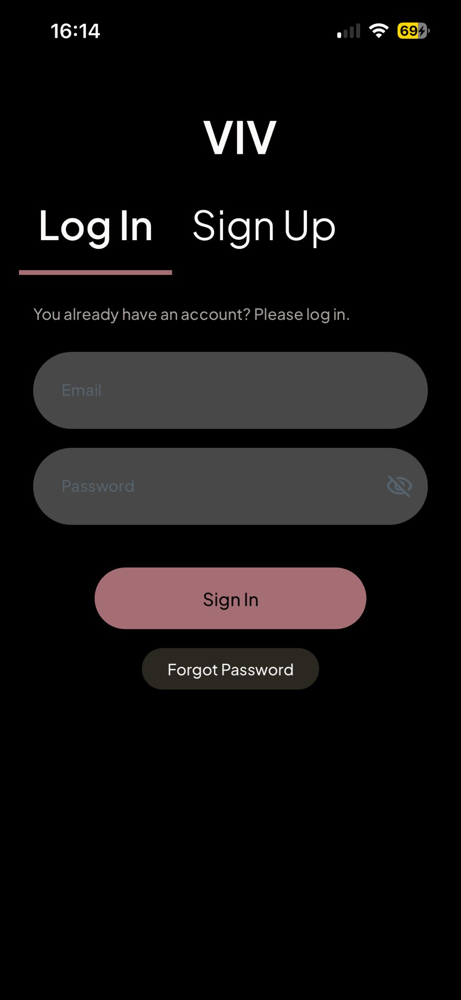
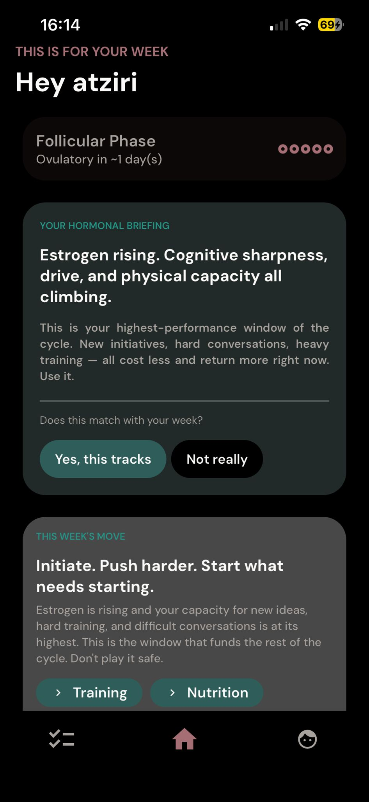
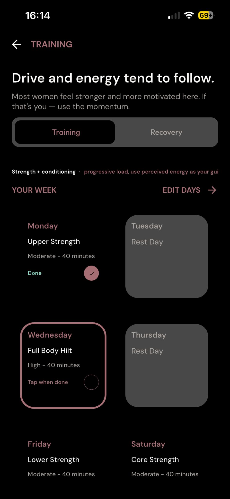
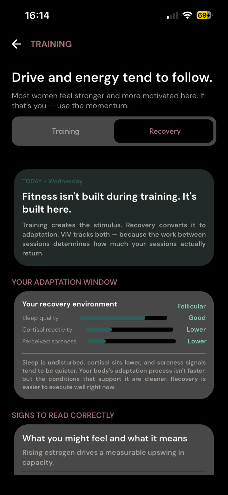
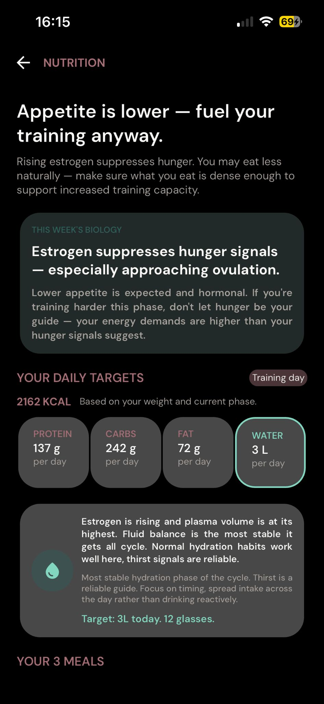
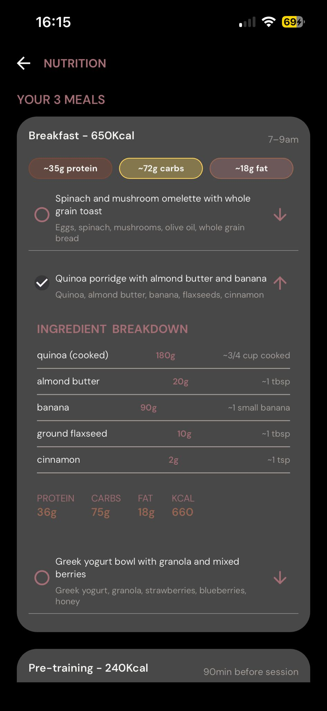

  

<h1 align="center">VIV</h1>

  Your intelligent wellness companion · iOS & Android

  
  
  
  

---

## What is VIV?

VIV is a mobile wellness app that combines artificial intelligence with personalized training, recovery, and healthy habit plans. The app analyzes your lifestyle, activity level, and goals to create routines tailored to you — ones that evolve as you do.

## ✨ Key Features

- **Personalized training plans** — AI-generated based on your level, goals, and availability
- **Adaptive rule engine** — adjusts intensity and training type in real time
- **Smart recovery** — rest tracking and active recovery recommendations
- **Motivational notifications** — personalized reminders at just the right moment
- **History & progress** — visualize your evolution week by week

## 📱 Screenshots

## 🚀 Download

| Platform | Link |
|----------|------|
| iOS      | [TestFlight](https://testflight.apple.com/join/4k4jgCmB) |
| Android  | [Google Play Testing](https://play.google.com/apps/internaltest/4701483169329513527) |

## 💬 Support & Feedback

Have a suggestion, found a bug, or just want to share your experience?

- 🐛 **Bugs / issues**: [Open an issue](../../issues/new?template=bug_report.md)
- 💡 **Feature requests**: [Suggest a feature](../../issues/new?template=feature_request.md)
- 💬 **General questions**: [GitHub Discussions](../../discussions)
- 📧 **Direct contact**: support@viv.app

## 🔒 Privacy

VIV treats health data with the utmost seriousness. See our [Privacy Policy](https://viv.app/privacy) for more information.

---

Made with ❤️ by the VIV team

